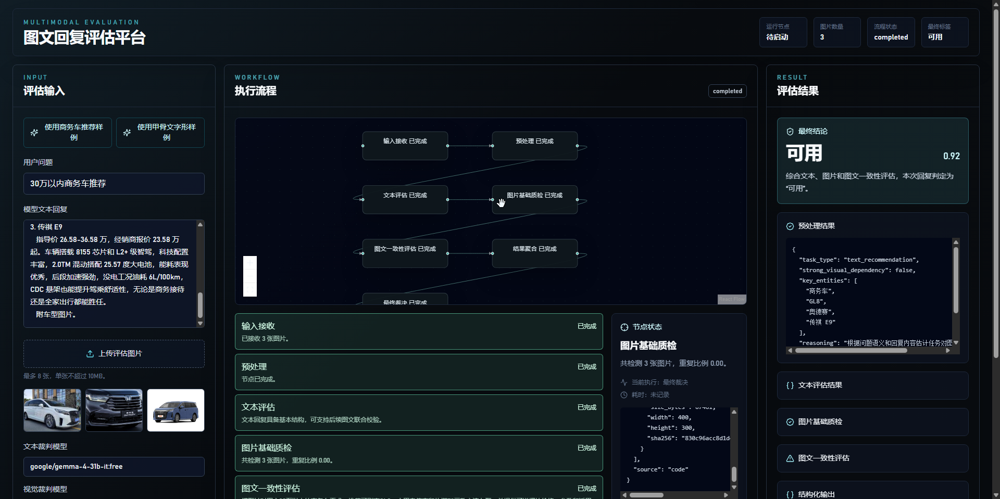
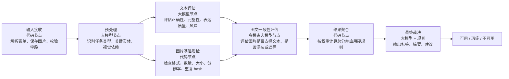

# LLM-based Quality Evaluation

一个本地可运行的图文回复质量评估平台，用于对大模型图文回复进行自动化评估，并输出 `可用 / 瑕疵 / 不可用` 的最终结论。

平台包含前后端完整实现：前端提供评估输入、图片预览、Workflow 状态、节点详情、结构化结果和运行日志；后端通过 OpenRouter 调用 Gemma 4 31B 多模态模型，并结合代码规则完成聚合评分。



## Features

- 图文输入评估：支持用户问题、模型文本回复、多张图片上传。
- OpenRouter 接入：支持文本裁判、多模态裁判、超时、重试和结构化解析 fallback。
- Workflow 可视化：展示输入接收、预处理、文本评估、图片质检、图文一致性、结果聚合、最终裁决。
- 流式运行状态：前端优先使用 SSE 展示节点状态，失败时回退同步接口。
- 内置样例：`images/1-*` 对应商务车推荐，`images/2-*` 对应甲骨文字形。
- 工程化结构：配置集中、Prompt 集中、前后端字段统一、测试覆盖核心规则。

## Workflow



评分权重：

- 文本评估：40%
- 图片基础质检：15%
- 图文一致性评估：45%

标签规则：

- `final_score >= 0.75`：可用
- `0.45 <= final_score < 0.75`：瑕疵
- `final_score < 0.45`：不可用

硬规则会直接压级为 `不可用`，例如强视觉依赖任务缺少图片、图文一致性过低、无关图片比例过高、误导风险过高。

## Project Structure

```text
backend/
  app/
    prompts/        Prompt 集中管理
    services/       OpenRouter client、workflow、图片处理、聚合规则
    main.py         FastAPI 入口
    schemas.py      后端数据结构
  tests/            后端测试
  pyproject.toml

frontend/
  src/
    components/     输入面板、流程面板、结果面板、日志面板
    lib/            API、样例、workflow 状态映射、校验
    types/          前端类型定义
    App.tsx
  package.json

images/             内置样例图片和 README 截图
model.txt           OpenRouter 默认模型配置
spec.md             初版设计规范
题目.md             面试题原始要求
```

## Requirements

- Python 3.11 或 3.12
- uv
- Bun 或 Node.js 20+
- OpenRouter API Key

`model.txt` 已包含默认配置格式，后端会自动解析：

```text
API:<OPENROUTER_API_KEY>
model="google/gemma-4-31b-it:free"
```

也可以用环境变量覆盖：

```env
OPENROUTER_API_KEY=
OPENROUTER_BASE_URL=https://openrouter.ai/api/v1
OPENROUTER_TEXT_MODEL=google/gemma-4-31b-it:free
OPENROUTER_VISION_MODEL=google/gemma-4-31b-it:free
OPENROUTER_TIMEOUT_SECONDS=120
OPENROUTER_MAX_RETRIES=2
```

读取优先级：

1. 环境变量
2. `model.txt`
3. 缺失必填配置时报错

## Run Locally

### Backend

```powershell
cd backend
uv sync --group dev
uv run uvicorn app.main:app --reload --host 0.0.0.0 --port 8001
```

如果不使用 `uv`，也可以在项目根目录用 `requirements.txt` 安装后端运行依赖：

```powershell
python -m venv backend\.venv
backend\.venv\Scripts\Activate.ps1
pip install -r requirements.txt
uvicorn app.main:app --app-dir backend --reload --host 0.0.0.0 --port 8001
```

健康检查：

```text
http://localhost:8001/health
```

### Frontend

```powershell
cd frontend
bun install
bun run dev
```

访问：

```text
http://localhost:5173
```

如果你需要代理下载依赖：

```powershell
$env:HTTP_PROXY="http://127.0.0.1:10811"
$env:HTTPS_PROXY="http://127.0.0.1:10811"
bun install
```

如果当前 shell 的 `node` 命令命中 WindowsApps 并出现 `Access is denied`，把可用 Node 放到 PATH 前面后再执行前端命令。

## Build Windows ZIP Package

如果要交付给没有 Python、Node、uv、Bun 的 Windows 机器，使用一键 ZIP 包：

```powershell
powershell -ExecutionPolicy Bypass -File .\scripts\build_windows_zip.ps1
```

如果在 WSL/Linux 里打包 Windows ZIP，使用：

```bash
python3 scripts/build_windows_zip.py
```

输出文件：

```text
artifacts/windows/LLM-Evaluation-Demo.zip
```

ZIP 解压后双击 `Start.bat` 即可启动。启动脚本会显示日志窗口、自动选择本地端口、启动 FastAPI 服务，并打开默认浏览器。

包结构：

```text
LLM-Evaluation-Demo/
  Start.bat
  app/
    backend/
    frontend_dist/
    images/
    model.txt
  runtime/
    python/
  data/
    uploads/
  logs/
```

注意：`model.txt` 会被复制进 ZIP 包。如果其中包含 OpenRouter API Key，请把生成的 ZIP 当作含密钥文件管理，不要公开分发。

## API

### `GET /health`

```json
{"ok": true}
```

### `POST /api/evaluate`

请求类型：`multipart/form-data`

字段：

- `user_question`
- `model_answer`
- `images`
- `text_model`
- `vision_model`

返回完整评估结果，包括 `workflow.nodes`、各节点结构化输出、最终标签和运行日志。

### `POST /api/evaluate/stream`

SSE 流式返回：

- `run_started`
- `node_update`
- `log`
- `run_completed`
- `run_failed`

## Verification

后端测试：

```powershell
uv run --project backend --group dev pytest backend/tests
```

前端测试：

```powershell
cd frontend
bun run test
```

前端构建：

```powershell
cd frontend
bun run build
```

如果 Bun 在当前环境无法 remap `node_modules/.bin`，可以直接用 Node 入口验证：

```powershell
node .\node_modules\vitest\vitest.mjs run
node .\node_modules\typescript\bin\tsc -b
node .\node_modules\vite\bin\vite.js build
```

## Troubleshooting

- 图片格式错误：仅支持 PNG、JPG、JPEG、WEBP，单张不超过 10MB。
- 样例图片无法加载：确认后端已启动，且 `images/` 目录存在。
- 模型调用失败：检查 `model.txt`、环境变量、模型名和网络代理。
- 流式通道失败：前端会自动回退到同步接口，并在运行日志中记录切换原因。

## Release

`v0.1.0` 是第一个可正常本地运行的版本，包含完整前后端、OpenRouter 接入、两组内置样例和基础测试。
